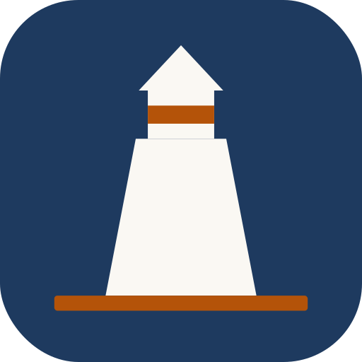

  

  # Lighthouse

  ### Project-based writing for Obsidian

  
  
  

  [Documentation](https://benjamincassidy.github.io/lighthouse/) · [Community Plugin listing](https://community.obsidian.md/plugins/lighthouse) · [Report an issue](https://github.com/benjamincassidy/lighthouse/issues)

 

> "It was done; it was finished. Yes, she thought, laying down her brush in extreme fatigue, I have had my vision."
> — Virginia Woolf, *To the Lighthouse*

Lighthouse brings the focus of a dedicated writing app to Obsidian, inspired by Ulysses but without giving up Obsidian's power and flexibility. One command opens a dedicated Library and Inspector for a project — groups, goals, pacing, and focus, all built on plain markdown files in your vault. No lock-in, no proprietary format.

## Screenshots

<table>
  <tr>
    <td width="50%"> <b>The Writing Workspace</b> — Library, editor, and Inspector side by side</td>
    <td width="50%"> <b>The Inspector</b> — live word counts, deadline pacing, and streak</td>
  </tr>
  <tr>
    <td width="50%"> <b>Groups & Extras</b> — nested groups, tinted icons for research notes</td>
    <td width="50%"> <b>Export</b> — compile to PDF, DOCX, or EPUB with style presets</td>
  </tr>
  <tr>
    <td width="50%"> <b>Flow Mode</b> — distraction-free writing</td>
    <td width="50%"></td>
  </tr>
</table>

## Features

**Writing Workspace**
- The Library — a Ulysses-style Groups & Sheets browser in the left sidebar, replacing Obsidian's file explorer for the duration; drag-and-drop to reorder groups and sheets
- The Inspector — right-sidebar panel with Overview (goal ring, writing heatmap, streak), Stats (live counts, pacing), and Outline tabs
- One-command layout — toggle the whole workspace on/off from the ribbon; the native file explorer is restored automatically on exit

**Project Management**
- Multiple projects — create and manage independent writing projects, each with its own configuration
- Groups & Extras — organize a project into nestable Groups with custom icons; a built-in Extras group holds research and notes excluded from word counts
- Project switcher — fuzzy-search modal to jump between projects instantly

**Word Counting**
- Smart hierarchical counts — real-time word counts at file, group, and project levels
- Per-file and per-group goals — set individual targets on files or groups with inline progress rings
- Word count goal directions — at least (minimum target) or at most (word limit / trim mode)
- Status bar count — live word count visible at the bottom of every window

**Progress & Pacing**
- Deadline tracking — set a target finish date; see words/day needed and days remaining
- Adaptive daily pace — required daily target recalculates automatically as you write over or under the target
- Writing activity heatmap — a 13-week calendar of daily output with variable-size circles
- Writing streak — current streak and personal best; rest days keep the chain alive
- 7-day rolling average — on-pace / behind-pace indicator against your required daily target
- Read/speak time — estimated reading time (250 wpm) and speaking time (130 wpm) for the project total

**Export & Editing**
- Compile & export — PDF (via Typst), DOCX and EPUB (via Pandoc), or plain Markdown, with built-in style presets and paper sizes
- Citations — per-project bibliography and CSL citation style, with 10 bundled styles and the ability to download thousands more
- Split & merge — split a note at the cursor into a new sibling file; merge one note into another from its context menu

**Flow Mode**
- Hides sidebars, ribbon, status bar, tabs, breadcrumbs, and navigation
- Optional typewriter scroll, custom font, line height, and line width settings

### Roadmap

- Manuscript Mode — continuous read-only multi-file view for reading your whole draft as one document
- Project-wide Outline — cross-file heading tree for navigation, beyond the current per-file Outline tab
- Dataview integration — enhanced Inspector queries
- Templater integration — project-aware template variables

## Quick Start

1. **Create a project** — Command Palette → `Lighthouse: Create new project`
2. **Open the Writing Workspace** — click the compass icon in the ribbon
3. **Add Groups** — organize your writing into Groups in the Library; research and notes go in the built-in Extras group
4. **Set a goal (optional)** — edit the project and add a word count goal and deadline
5. **Start writing** — Lighthouse tracks everything automatically, with live stats in the Inspector

See the [Getting Started guide](https://benjamincassidy.github.io/lighthouse/getting-started/introduction/) for the full walkthrough.

## Installation

Open the [Lighthouse listing](https://community.obsidian.md/plugins/lighthouse) on the Obsidian Community Plugins website and click **Add to Obsidian** — this opens Obsidian directly to the install page. See the [installation guide](https://benjamincassidy.github.io/lighthouse/getting-started/installation/) for the in-app browse method and manual installation.

## Contributing

Contributions are welcome — bug reports, feature suggestions, and pull requests. Open an [issue](https://github.com/benjamincassidy/lighthouse/issues) to start a discussion before larger changes.

## Support

If you find Lighthouse helpful, consider:
- Starring the repository
- [Sponsoring on GitHub](https://github.com/sponsors/benjamincassidy)
- Reporting bugs and suggesting features
- Improving documentation

## License

MIT License — see [LICENSE](LICENSE) for details.

## Acknowledgments

Built for the [Obsidian](https://obsidian.md/) community.
