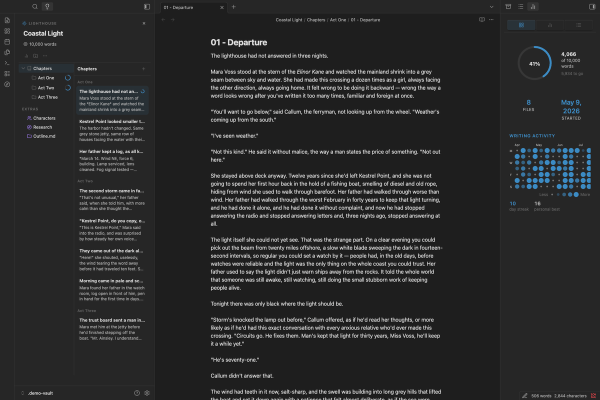
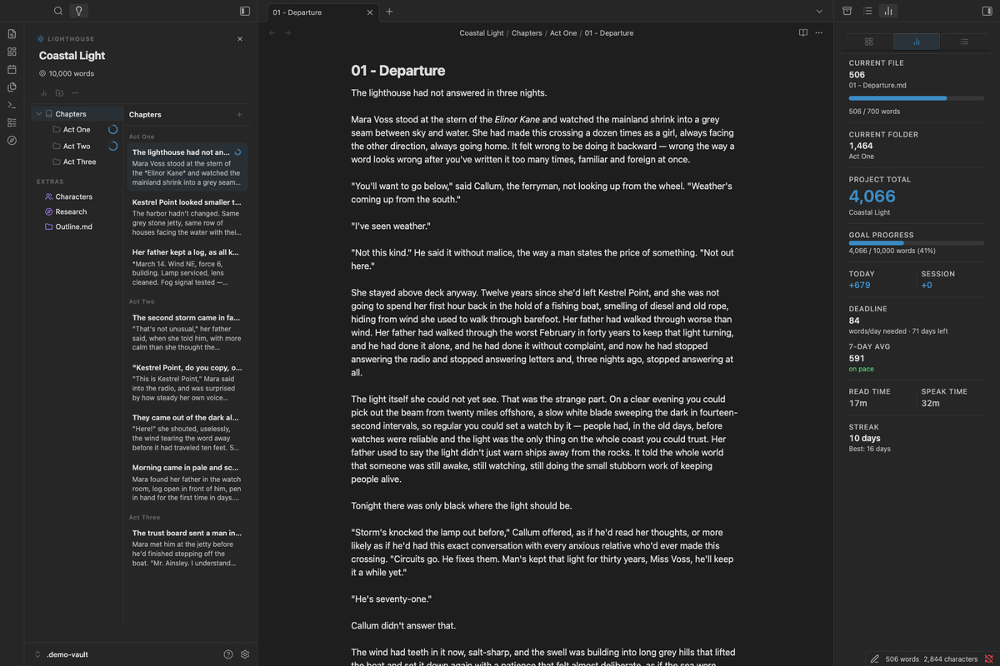
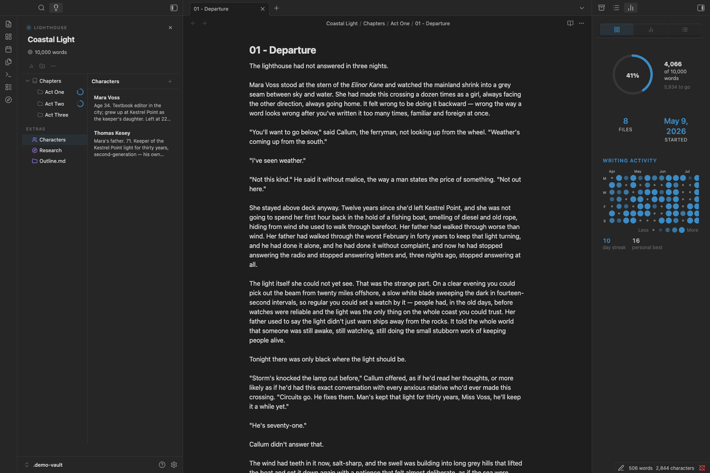
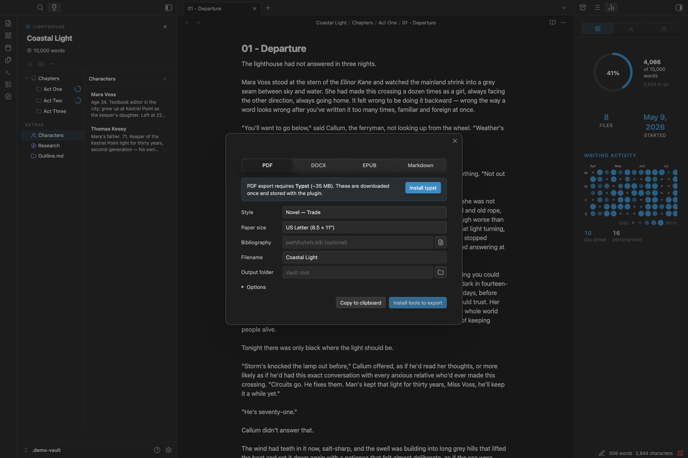
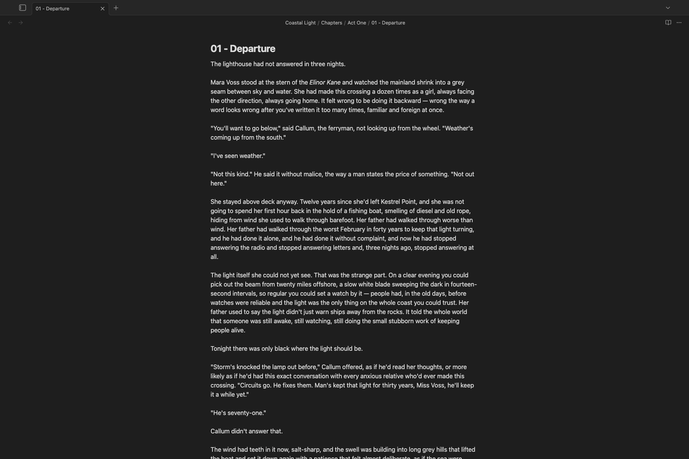

# Lighthouse

> "It was done; it was finished. Yes, she thought, laying down her brush in extreme fatigue, I have had my vision."
> — Virginia Woolf, *To the Lighthouse*

 

### Project-based writing for Obsidian.

Lighthouse brings professional writing project management to Obsidian, inspired by Ulysses but without sacrificing Obsidian's power and flexibility. Perfect for novelists, academic writers, and anyone working on long-form writing projects.

 

---

## 📖 [Full Documentation](https://benjamincassidy.github.io/lighthouse/)

Visit the [complete documentation site](https://benjamincassidy.github.io/lighthouse/) for detailed guides, tutorials, and reference materials.

## Screenshots

<table>
  <tr>
    <td width="50%"> <b>The Writing Workspace</b> — Library, editor, and Inspector side by side</td>
    <td width="50%"> <b>The Inspector</b> — live word counts, deadline pacing, and streak</td>
  </tr>
  <tr>
    <td width="50%"> <b>Groups & Extras</b> — nested groups, tinted icons for research notes</td>
    <td width="50%"> <b>Export</b> — compile to PDF, DOCX, or EPUB with style presets</td>
  </tr>
  <tr>
    <td width="50%"> <b>Flow Mode</b> — distraction-free writing</td>
    <td width="50%"></td>
  </tr>
</table>

## Features

### ✅ Implemented

**Writing Workspace**
- **The Library** — A Ulysses-style Groups & Sheets browser in the left sidebar, replacing Obsidian's file explorer for the duration; drag-and-drop to reorder groups and sheets
- **The Inspector** — Right-sidebar panel with Overview (goal ring, writing heatmap, streak), Stats (live counts, pacing), and Outline tabs
- **One-command layout** — Toggle the whole workspace on/off from the ribbon; native file explorer is restored automatically on exit

**Project Management**
- **Multiple Projects** — Create and manage independent writing projects, each with its own configuration
- **Groups & Extras** — Organize a project into nestable Groups with custom icons; a built-in Extras group holds research and notes excluded from word counts
- **Project Switcher** — Fuzzy-search modal to jump between projects instantly

**Word Counting**
- **Smart hierarchical counts** — Real-time word counts at file, group, and project levels
- **Per-file and per-group goals** — Set individual targets on files or groups with inline progress rings
- **Word count goal directions** — *At least* (minimum target) or *at most* (word limit / trim mode)
- **Status bar count** — Live word count visible at the bottom of every window

**Progress & Pacing**
- **Deadline tracking** — Set a target finish date; see words/day needed and days remaining
- **Adaptive daily pace** — Required daily target recalculates automatically as you write over or under the target
- **Writing activity heatmap** — GitHub-style calendar showing 13 weeks of daily output with variable-size circles
- **Writing streak** — Current streak and personal best; rest days keep the chain alive
- **7-day rolling average** — On-pace / behind-pace indicator against your required daily target
- **Read/speak time** — Estimated reading time (250 wpm) and speaking time (130 wpm) for the project total

**Export & Editing**
- **Compile & Export** — PDF (via Typst), DOCX and EPUB (via Pandoc), or plain Markdown, with built-in style presets and paper sizes
- **Citations** — Per-project bibliography and CSL citation style, with 10 bundled styles and the ability to download thousands more
- **Split & Merge** — Split a note at the cursor into a new sibling file; merge one note into another from its context menu

**Flow Mode**
- Hides sidebars, ribbon, status bar, tabs, breadcrumbs, and navigation
- Optional typewriter scroll, custom font, line height, and line width settings

### 🚧 Planned

- **Manuscript Mode** — Continuous read-only multi-file view for reading your whole draft as one document
- **Project-wide Outline** — Cross-file heading tree for navigation, beyond the current per-file Outline tab
- **Dataview Integration** — Enhanced Inspector queries
- **Templater Integration** — Project-aware template variables

## Development Status

**Active development:** All features listed above are implemented and tested. The plugin is ready for daily use. The Community Plugin submission is in progress.

## Quick Start

1. **Create a project** — Command Palette → `Lighthouse: Create new project`
2. **Open the Writing Workspace** — Click the compass icon in the ribbon
3. **Add Groups** — Organize your writing into Groups in the Library; research and notes go in the built-in Extras group
4. **Set a goal (optional)** — Edit the project and add a word count goal and deadline
5. **Start writing** — Lighthouse tracks everything automatically, with live stats in the Inspector

## Contributing

Contributions welcome! This is an early-stage project. See [LIGHTHOUSE_PROJECT_BRIEF.md](LIGHTHOUSE_PROJECT_BRIEF.md) for architecture and design decisions.

## Support

If you find Lighthouse helpful, consider:
- ⭐ Starring the repository
- 💝 [Sponsoring on GitHub](https://github.com/sponsors/benjamincassidy)
- 🐛 Reporting bugs and suggesting features
- 📖 Improving documentation

## License

MIT License - see [LICENSE](LICENSE) for details.

## Acknowledgments

- Built for the [Obsidian](https://obsidian.md/) community
